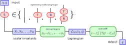

[](https://github.com/PyCQA/pylint)
[](https://github.com/psf/black)
[](https://github.com/eikehmueller/mlconservation_code/actions/workflows/python-app.yml)

# Neural network solvers for dynamical systems with exact conservation laws
Following the ideas in [Greydanus et al. (2019)](https://arxiv.org/abs/1906.01563), the Lagrangian is represented by a neural network, from which the acceleration $\ddot{q}$ for a given position $q$ and velocity $\dot{q}$ can be computed via automatic differentiation. The key novelty of this work is the ability to *exactly* conserve certain physical quantities. This is achieved by using Noether's Theorem, which relates continuous symmetries of the Lagrangian with conservation laws. The neural networks are trained on noisy synthetic data obtained by solving the true equations of motion.



A range of dynamical systems have been implemented:
* A **system of $N$ two-dimensional spins** with nearest-neighbour interactions; the system is invariant under global rotations of all spins.
* The motion of a **relativistic particle in an electromagnetc field**. Depending on the structure of the electric and magnetic fields, the system is invariant under rotations and/or translations.
* A single **non-relativistic particle moving in a three-dimensional potential**. Here the considered true solution corresponds to motion in a Newtonian gravitational potential.
* **Two interacting particles moving in $d$ dimensions**; if the pairwise potential is invariant under rotations and translations the total linear- and angular momentum are conserved
* A single **relativistic particle moving in $1+3$ dimensional space-time**. Here the true solution is given by geodesics of the Schwarzschild metric, which is invariant under three-dimensional rotations.

## Repository structure
The main Python files are collected in the [src](./src) directory. The [assets](./directory) collects the weights of several trained models. The scripts in the main directory can be used to evaluate the trained model and visualise the solutions.
* [EvaluateModel.ipynb](EvaluateModel.ipynb) Evaluates the performance of the two-particle model. The trajectories of the rained Lagrangian neural network model are compared with the true trajectories and the (approximate) conservation of conserved quantities is demonstracted.
* [EvaluateKeplerModel.ipynb](EvaluateKeplerModel.ipynb) Contains the corresponding code for the Kepler model, i.e. non-relativistic motion of a single particle in the Newtonian potential.
* [Kepler.ipynb](Kepler.ipynb) Contains several derivations relating to the exact dynamics of particles moving in the non-relativistic Newton potential and in the Schwarzschild metric.
* [VisualiseTrajectories.ipynb](VisualiseTrajectories.ipynb) This notebook was mainly written for debugging and to choose sensible parameters for the true solutions that are used to train the models. It can be used to visualise the trajectories for the considered systems.

## Running the code
### Training the neural networks
The neural network models can be trained with the [train_model.py](src/train_model.py) script, which reads its parameters from a `.toml` configuration file. You might want to copy and modify the template in (training_parameters_template.toml)[training_parameters_template.toml]. To run the code, use

```
python src/train_model.py --parameterfile=PARAMETERFILE
```

where `PARAMETERFILE` is the name of the `.toml` file with the parameters. If you leave out the `--parameterfile` flag, this defaults to `training_parameters.toml`.

### Evaluating and visualising trained models
To evaluate the trained models and assess their performance, use [EvaluateModel.ipynb](EvaluateModel.ipynb) and [EvaluateKeplerModel.ipynb](EvaluateKeplerModel.ipynb)

## Testing
Tests are collected in the [tests subdirectory](tests). To run all tests use

```
pytest
```

